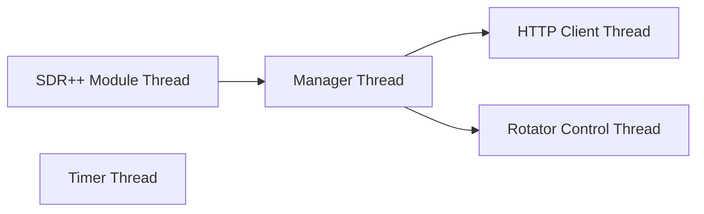

# Ground Station Manager
Ground Station Manager software module that conrols a ground station. 

The following features are supported:
* Interfaces with web-server to download tasks and upload data.
* Interfaces with gpredict module to calculate time and position of satellites
* Controls the rotator to position the dish towards satellite
* Download data from the satellite via the radio
* GUI interface to configure and control the ground station.
	

## Software Architecture
The Ground Station Manager is built on SDR++ which is a cross-platform software-defined radio software.  The software is written in C++ and follows object-oriented design best practices.

### Class Definitions
The main classes are:
* GroundStationMgr - the main class that is entry point of the module and interfaces with SDR++ core services
* GsmHttpClient - HTTP client that handles transactions with the web-server. 
* GsmTaskMgr - class that manages multiple tasks that are assigned to the ground-station by the web-server
* GsmTask - class the represents an individual task
* GsmSatellite - class that represents a satellite, uses gpredict to calculate position and location
* GsmRotator - class that controls the rotator
* GsmTimer - timers

### Threading Architecture
The Ground Station Manager is multithreaded module to support multiple transactions occuring simultaneously without impacting eachother.
* Module thread - main thread created by sdr++
* Manager thread - Ground station manager thread used to send/receive messages from HTTP client and rotator control threads.
* Http Client thread - thread created for each HTTP transaction to the web-server
* Rotator Control thread - thread used to communicate with rotator

## Building the software

## Deployment

## Configuration and Operation

